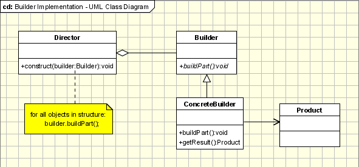

## Definition

```Separates object construction from its representation```

```how a composite object gets created```

```parse a complex representation, create one of several targets```


## **Context:(`WHEN TO USE?`)** 
__Builder Pattern is used when:__

1.the creation algorithm of a complex object is independent from the parts that actually compose the object.

2.the system needs to allow different representations for the objects that are being built.

3.This template is used when we want to encapsulate the creation of a complex object.

## **Problem:(`WHY USE ?`)** 

What are we trying to solve?

 ## **Solution:(`HOW TO ?`)** 

How does using this pattern solve our proposed problem?
Implementation: What does the implementation look like?  

## **Implementation:(`SYNTAX`)** 





## **Examples:(`USE CASE`)** 


## Example 1 - Vehicle Manufacturer.


~~~~
Let us take the case of a vehicle manufacturer that, from a set of parts, can build a car, a bicycle, a motorcycle or a scooter. In this case the Builder will become the VehicleBuilder. It specifies the interface for building any of the vehicles in the list above, using the same set of parts and a different set of rules for every type of type of vehicle. The ConcreteBuilders will be the builders attached to each of the objects that are being under construction. The Product is of course the vehicle that is being constructed and the Director is the manufacturer and its shop.
~~~~
  ##### The classes and objects participating in this pattern are:

- **Builder**  (VehicleBuilder)
~~~~
specifies an abstract interface for creating parts of a Product object
~~~~

- **ConcreteBuilder**  (MotorCycleBuilder, CarBuilder, ScooterBuilder)
~~~~
- constructs and assembles parts of the product by implementing the Builder interface
- defines and keeps track of the representation it creates
- provides an interface for retrieving the product
~~~~

- **Director**  (Shop)
~~~~
- constructs an object using the Builder interface
~~~~
- **Product**  (Vehicle)
~~~~
- represents the complex object under construction. ConcreteBuilder builds the product's internal representation and defines the process by which it's assembled
- includes classes that define the constituent parts, including interfaces for assembling the parts into the final result
~~~~


### [PHP Example Code](/) 


Example 2 - Students Exams.
~~~~
If we have an application that can be used by the students of a University to provide them with the list of their grades for their exams, this application needs to run in different ways depending on the user that is using it, user that has to log in. This means that, for example, the admin needs to have some buttons enabled, buttons that needs to be disabled for the student, the common user. The Builder provides the interface for building form depending on the login information. The ConcreteBuilders are the specific forms for each type of user. The Product is the final form that the application will use in the given case and the Director is the application that, based on the login information, needs a specific form.
~~~~
