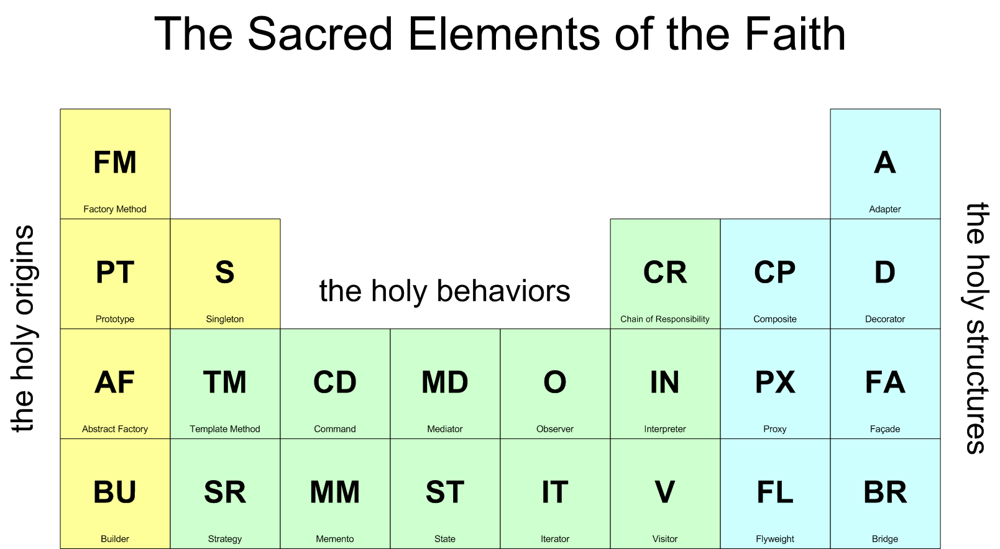

# Design Patterns 
>A design pattern is a general, reusable solution to a commonly occurring problem

I practice  in various scripts,languages what I know , 
Just for Learning purpose. 

Inspired by Gang of four design patterns (GOF)

>Every folder contain `README.md` file to explain in following manner 

- **Context:(`WHEN TO USE?`)** Where/under what circumstances is the pattern used? 

- **Problem:(`WHY USE ?`)** What are we trying to solve?

- **Solution:(`HOW TO ?`)** How does using this pattern solve our proposed problem?
Implementation: What does the implementation look like?  

- **Implementation:(`SYNTAX`)** 
How it can be implements in programming language.

- **Examples:(`USE CASE`)** 

